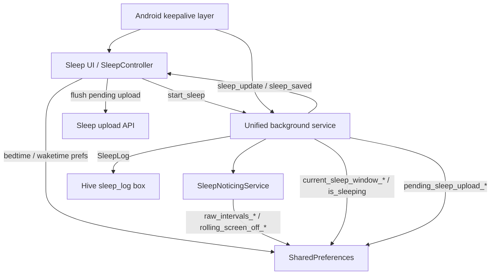

# Sleep Service Architecture

## Overview

Snevva's sleep tracking is a hybrid Flutter + Android system, but the active
sleep logic now lives primarily in Dart.

The current design is built around three ideas:

1. The app records screen `OFF`/`ON` intervals continuously, not only while a
   sleep session is marked active.
2. Sleep is calculated by clipping those raw intervals to the user's active
   sleep window.
3. Android keeps the long-running services alive, but it no longer calculates
   sleep intervals itself.

That architecture makes sleep tracking more resilient to service restarts,
late app launches, missed UI sessions, and overnight cross-midnight windows.

## Core Components

### Flutter / Dart

- `lib/Controllers/SleepScreen/sleep_controller.dart`
    - UI-facing GetX service.
    - Restores sleep state for the app.
    - Listens to background events such as `sleep_update` and `sleep_saved`.
    - Persists bedtime/waketime preferences.
    - Flushes the pending sleep upload queue on init.

- `lib/views/information/Sleep Screen/sleep_bottom_sheet.dart`
    - Main user entry point for starting and stopping sleep tracking.
    - Ensures the unified background service is running before sending
      `start_sleep`.
    - Sets the `manually_stopped` guard so nightly auto-start does not
      immediately restart the same window after a manual stop.

- `lib/services/app_initializer.dart`
    - Creates the shared foreground notification channel.
    - Configures `flutter_background_service`.
    - Starts the unified background isolate with `autoStart` and
      `autoStartOnBoot`.

- `lib/services/unified_background_service.dart`
    - Main background isolate entry point.
    - Owns sleep session lifecycle, auto-start, restore, heartbeat, save,
      notifications, and step/sleep event routing.
    - Writes final sleep logs to Hive.
    - Queues uploads for the main isolate via SharedPreferences.

- `lib/services/sleep/sleep_noticing_service.dart`
    - Always-on screen state monitor.
    - Records raw screen-off intervals into SharedPreferences.
    - Computes total sleep minutes by clipping raw intervals to the active sleep
      window and merging overlaps.

- `lib/models/hive_models/sleep_log.dart`
    - Hive persistence model for finalized sleep sessions.

### Android / Kotlin

- `android/app/src/main/kotlin/com/coretegra/snevva/StepCounterService.kt`
    - Foreground service that keeps the app active for step tracking.
    - Shares the same notification channel and notification ID as the Dart
      background isolate.
    - Sends step and sparse wakeup events back into Flutter when possible.

- `android/app/src/main/kotlin/com/coretegra/snevva/MainActivity.kt`
    - Exposes the `com.coretegra.snevva/sleep_service` method channel.
    - Native `startSleepService` / `stopSleepService` no longer start a separate
      native sleep tracker. They now only schedule or cancel helper work.

- `android/app/src/main/kotlin/com/coretegra/snevva/BootReceiver.kt`
    - Restarts the native step service after reboot or package replacement.
    - Re-schedules helper sleep work.

- `android/app/src/main/kotlin/com/coretegra/snevva/WatchdogWorker.kt`
    - Periodically tries to revive the Flutter background service.

- `android/app/src/main/kotlin/com/coretegra/snevva/ResurrectionWorker.kt`
    - Restarts the step service after task removal.

- `android/app/src/main/kotlin/com/coretegra/snevva/SparseWakeupReceiver.kt`
    - Fires a 15-minute sparse wakeup and forwards it to Flutter when a live
      engine exists.

- `android/app/src/main/kotlin/com/coretegra/snevva/SleepCalcWorker.kt`
    - Legacy helper worker.
    - No longer writes or calculates sleep intervals.
    - Currently exists to trigger follow-up work around wake time.

## Runtime Flow

## End-to-End Sleep Lifecycle

### 1. Schedule and session start

When the user starts sleep tracking from the sleep bottom sheet:

- Bedtime and waketime are written to SharedPreferences as:
    - `user_bedtime_ms`
    - `user_waketime_ms`
- Manual-stop guard keys are cleared:
    - `manually_stopped`
    - `manually_stopped_window_key`
- The UI ensures the unified background service is running.
- Flutter sends `start_sleep` to the background isolate with:
    - `goal_minutes`
    - `bedtime_minutes`
    - `waketime_minutes`

The background isolate then:

- Sets session state:
    - `is_sleeping`
    - `sleep_start_time`
    - `sleep_goal_minutes`
- Pins the current sleep window:
    - `current_sleep_window_start`
    - `current_sleep_window_end`
    - `current_sleep_window_key`
- Seeds the rolling screen-off anchor if the service booted mid-window.

### 2. Always-on raw event capture

`SleepNoticingService` starts once when the background isolate boots and should
stay alive for the life of that isolate.

It listens to `screen_state` events:

- On `SCREEN_OFF`
    - stores `rolling_screen_off_<YYYY-MM-DD>`
- On `SCREEN_ON`
    - closes the open interval
    - appends to `raw_intervals_<YYYY-MM-DD>`
    - merges overlaps
    - drops intervals shorter than 3 minutes

Important detail:

- Raw capture does **not** check `is_sleeping`.
- The system records screen-off intervals continuously and filters them later
  using the active window.

### 3. Sleep calculation

Sleep minutes are calculated inside
`lib/services/sleep/sleep_noticing_service.dart`.

The calculator:

1. Reads raw closed intervals for the current window day and the previous day.
2. Includes an open interval if the screen is still off.
3. Clips every interval to `[window.start, window.end]`.
4. Merges overlaps.
5. Sums total minutes.

This is the main architectural shift from the older design:

- Sleep is derived from raw evidence plus window clipping.
- It is not directly stored as a running list of "sleep intervals" owned by
  the native layer.

### 4. Heartbeat, restore, and nightly auto-start

The unified background service runs a 1-minute heartbeat.

If `is_sleeping == true`:

- It recomputes total sleep minutes.
- Emits `sleep_update`.
- Updates the foreground notification.
- Auto-stops and saves once the pinned window has ended.

If `is_sleeping == false`:

- It checks whether the current time has entered the user's configured sleep
  window.
- If yes, it auto-starts a new sleep session for that window.

Auto-start is blocked for the current window when:

- `manually_stopped == true`
- and `manually_stopped_window_key` matches the current window key

This prevents the heartbeat from re-enabling sleep right after the user taps
"Stop & Save Sleep".

### 5. Session stop and save

Sleep can stop in two ways:

- user action via `stop_sleep`
- automatic stop once the pinned window ends

When stopping, the background isolate:

- clamps effective start and end to the pinned window
- asks `SleepNoticingService` for the final clipped total
- writes a `SleepLog` into Hive
- clears live session keys
- emits `sleep_saved`
- restores the step notification

The saved log includes:

- `date`
- `durationMinutes`
- `startTime`
- `endTime`
- `goalMinutes`

Important note:

- The finalized Hive key is `current_sleep_window_key`, which is derived from
  the sleep window start date, not the wake date.
- That means the current implementation is effectively keyed by the bedtime
  day/window day, even though the `SleepLog.date` comment says it is usually
  the wake-up day.

### 6. Upload handoff to the main isolate

The background isolate does not directly upload sleep to the server.

Instead it writes a small queue into SharedPreferences:

- `pending_sleep_upload_start`
- `pending_sleep_upload_end`
- `pending_sleep_upload_duration`

`SleepController.onInit()` calls `_uploadPendingSleep()`, which:

- reads those keys
- calls `uploadsleepdatatoServer(...)`
- clears the queue only after a successful attempt

`lib/main.dart` also forces `SleepController` instantiation when a pending
sleep upload is detected so saved nights are not stranded just because the
sleep screen was never opened.

## Data Ownership

### SharedPreferences

Used for cross-isolate coordination, rolling raw interval storage, and crash
recovery.

Common keys:

- User schedule
    - `user_bedtime_ms`
    - `user_waketime_ms`
- Live session
    - `is_sleeping`
    - `sleep_start_time`
    - `sleep_goal_minutes`
- Pinned active window
    - `current_sleep_window_start`
    - `current_sleep_window_end`
    - `current_sleep_window_key`
- Raw capture buffer
    - `rolling_screen_off_<date>`
    - `raw_intervals_<date>`
- Auto-start guards
    - `last_auto_started_sleep_window`
    - `manually_stopped`
    - `manually_stopped_window_key`
- Upload queue
    - `pending_sleep_upload_start`
    - `pending_sleep_upload_end`
    - `pending_sleep_upload_duration`

### Hive

The `sleep_log` box stores finalized nightly results as `SleepLog` records.

This is the durable history used by the sleep UI for weekly and monthly
charts.

## Android Responsibilities vs Dart Responsibilities

### Dart owns

- sleep session state
- raw screen interval capture
- sleep calculation
- auto-start and auto-stop
- Hive persistence
- upload queue handoff
- UI event emission

### Android owns

- boot survival
- foreground-service survival
- notification channel creation fallback
- step sensor delivery
- sparse wakeups and watchdog-style recovery
- method channel plumbing for schedule updates

In practice, Android is the keepalive and transport layer, while Dart is the
sleep domain layer.

## Legacy and Superseded Pieces

These files are still present but are no longer the primary sleep path:

- `lib/services/background_pedometer_service.dart`
    - older split background service implementation
- `lib/services/sleep/hive_sleep_service.dart`
    - commented-out legacy abstraction
- `lib/services/sleep/api_sleep_service.dart`
    - commented-out legacy abstraction
- `android/app/src/main/kotlin/com/coretegra/snevva/SleepCalcWorker.kt`
    - no longer calculates sleep intervals
- `android/app/src/main/kotlin/com/coretegra/snevva/AlarmHelper.kt`
    - effectively legacy for sleep alarms

## Architecture Summary

The current sleep service is best understood as:

- an always-on raw screen-event recorder
- a background session manager that pins and evaluates sleep windows
- a Hive-backed nightly history store
- a deferred upload bridge from the background isolate to the main isolate
- an Android keepalive layer that improves survival, but does not own sleep
  calculation

That split is what gives the system its current resilience across overnight
tracking, app restarts, and background execution constraints.
